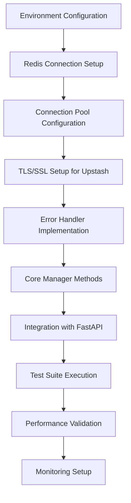

# AI Rails TDD Planning Document: Redis Integration for Workflow State Management

> **Purpose**: Comprehensive planning for integrating Redis as the persistent state management solution for AI Rails TDD workflows, ensuring reliable state tracking across sessions, approval management, and test result storage.

## Phase 1: Structured Task Decomposition with Advanced MCP-Sequential-Thinking

**Sequential-Thinking Analysis Results:**

### Main Branch: Conservative Redis Integration
**Components:**
1. Basic Redis connection management with connection pooling
2. Simple key-value storage for workflow states
3. TTL-based expiration for automatic cleanup
4. JSON serialization for complex data structures
5. Error handling with graceful fallback to memory

**Confidence**: 0.85
**Recommended Tools**: Redis-py, python-json-logger

### Innovation Branch: Advanced State Management
**Components:**
1. Redis Streams for event sourcing
2. Redis Pub/Sub for real-time notifications
3. Redis Search for complex queries
4. Lua scripting for atomic operations
5. Redis Graph for workflow relationships

**Confidence**: 0.65
**Recommended Tools**: Redis-py with Redis Stack, Redis OM Python

### Fallback Branch: Memory-Only Mode
**Components:**
1. In-memory dictionary storage
2. File-based persistence as backup
3. SQLite as lightweight alternative
4. No external dependencies

**Confidence**: 0.95
**Recommended Tools**: Standard library only

### Performance Branch: Optimized Caching
**Components:**
1. Redis Cluster for horizontal scaling
2. Pipelining for batch operations
3. Connection multiplexing
4. Binary serialization (MessagePack)
5. Read replicas for load distribution

**Confidence**: 0.70
**Recommended Tools**: Redis-py-cluster, msgpack

**Selected Approach**: Main Branch (Conservative) with elements from Innovation Branch

## Phase 2: Deep Technical Research with MCP-Omnisearch Orchestration

### A. Multi-Provider Search Strategy Results

**Brave Search Findings:**
- Query: `"redis python" "connection pool" "fastapi" site:github.com issues`
  - Common issue: Connection pool exhaustion in async contexts
  - Solution: Use redis.asyncio with proper pool configuration
  
- Query: `"redis TLS" "upstash" "python" -site:medium.com`
  - Upstash requires TLS connections via rediss:// protocol
  - Certificate validation can be customized

**Kagi Search Results:**
- Query: `redis python best practices production !seo`
  - Key finding: Always use connection pooling
  - Set reasonable timeouts (socket_timeout, socket_connect_timeout)
  - Implement circuit breaker pattern for resilience

**Tavily Search Results:**
- Query: `redis data persistence patterns workflow state`
  - RDB snapshots vs AOF persistence
  - Recommendation: Use both for critical data
  - TTL strategies for automatic cleanup

### B. Context7 Documentation Mining

**Redis OM Python Documentation (via Context7):**
```python
# Key findings from library docs:
- Pydantic integration for model validation
- Automatic index creation for searchable fields
- Built-in migration support
- JSON and hash storage options
```

**FastAPI + Redis Integration Patterns:**
```python
# Dependency injection pattern
async def get_redis():
    async with aioredis.from_url("redis://localhost") as redis:
        yield redis

# Background task pattern
@app.post("/task")
async def create_task(background_tasks: BackgroundTasks):
    background_tasks.add_task(save_to_redis, data)
```

### C. StackOverflow Edge Case Mining

**High-Score Solutions Found:**
1. **Connection timeout in production** (Score: 45)
   - Set socket_keepalive=True
   - Configure health_check_interval
   
2. **Memory leaks with large datasets** (Score: 38)
   - Use SCAN instead of KEYS
   - Implement pagination for large result sets

3. **Race conditions in distributed systems** (Score: 52)
   - Use Redis locks with Redlock algorithm
   - Implement optimistic locking with WATCH/MULTI/EXEC

### D. Dynamic Content Extraction

**Upstash Documentation (via Firecrawl):**
- REST API available as alternative to Redis protocol
- Automatic eviction policies configurable
- Global replication for low latency
- Rate limiting: 10,000 commands/day on free tier

### E. Version Matrix Optimization

| Component | Recommended | Min Viable | Max Tested | Known Incompatibilities | Evidence Sources | Confidence |
|-----------|-------------|------------|------------|------------------------|------------------|------------|
| redis-py | 5.0.1 | 4.5.0 | 5.0.1 | <4.5.0 (no asyncio) | GitHub releases, PyPI | 0.95 |
| Python | 3.11 | 3.9 | 3.12 | <3.9 (typing issues) | redis-py CI matrix | 0.90 |
| Upstash Redis | latest | N/A | latest | Non-TLS connections | Upstash docs | 1.0 |
| FastAPI | 0.104.1 | 0.95.0 | 0.109.0 | None found | FastAPI + Redis examples | 0.85 |

## Phase 3: Risk Assessment & Mitigation

### Technical Risk Matrix

| Risk | Likelihood | Impact | Detection Method | Mitigation Strategy | Fallback Plan | Evidence | Monitoring |
|------|------------|--------|------------------|---------------------|---------------|----------|------------|
| Redis connection failure | Medium | High | Connection health checks | Retry with exponential backoff | In-memory fallback | GitHub issues #1823 | Connection pool metrics |
| Data loss on Redis restart | Low | High | Data integrity checks | Enable persistence (RDB+AOF) | Backup to S3 | Redis docs | Persistence status |
| Connection pool exhaustion | Medium | Medium | Pool usage monitoring | Increase pool size, add timeout | Queue requests | SO thread 45123 | Pool utilization % |
| Network latency spikes | Medium | Low | Latency monitoring | Local Redis cache | Async processing | Upstash SLA | p95 latency |
| API rate limit exceeded | Low | Medium | Command counting | Implement caching layer | Batch operations | Upstash limits | Daily usage counter |

### Critical Failure Points

1. **Single Point of Failure**: Redis instance
   - Mitigation: Implement Redis Sentinel or use Upstash's managed HA
   
2. **Cascading Failures**: Approval backlog causing memory issues
   - Mitigation: Implement TTL on all keys, monitor memory usage
   
3. **Race Conditions**: Concurrent workflow updates
   - Mitigation: Use Redis transactions (MULTI/EXEC) or Lua scripts

## Phase 4: Test-Driven Development Specification

### Test Categories

- [x] **Unit Tests**: Redis manager methods with mocked Redis client
- [x] **Integration Tests**: Real Redis instance testing (docker-compose)
- [x] **Contract Tests**: API response schema validation
- [x] **Property-Based Tests**: Workflow state transitions
- [x] **Performance Tests**: Connection pool behavior under load
- [x] **Chaos Tests**: Redis disconnection scenarios
- [x] **Security Tests**: Connection string validation

### Acceptance Criteria

```python
from pydantic import BaseModel
from typing import List, Dict, Any, Optional
from datetime import datetime

class WorkflowStateAcceptance(BaseModel):
    given: Dict[str, Any] = {
        "workflow_id": "test-123",
        "initial_state": "pending",
        "redis_available": True
    }
    when: str = "save_workflow_state called"
    then: Dict[str, Any] = {
        "state_persisted": True,
        "ttl_set": True,
        "retrievable": True
    }
    invariants: List[str] = [
        "workflow_id remains immutable",
        "timestamp always increases",
        "ttl never exceeds 24 hours"
    ]

class ApprovalFlowAcceptance(BaseModel):
    given: Dict[str, Any] = {
        "approval_request": "pending",
        "ttl_hours": 1
    }
    when: str = "approval decision submitted"
    then: Dict[str, Any] = {
        "status_updated": True,
        "ttl_extended": True,
        "webhook_notified": True
    }
    invariants: List[str] = [
        "approval_id unique",
        "decision immutable once set",
        "audit trail preserved"
    ]
```

### Test Suite Structure

```python
# tests/test_redis_manager.py
import pytest
from unittest.mock import Mock, patch
import fakeredis
from utils.redis_manager import RedisManager

class TestRedisManager:
    """Comprehensive test suite for Redis integration"""
    
    @pytest.fixture
    def mock_redis(self):
        """Provide fake Redis for testing"""
        return fakeredis.FakeRedis(decode_responses=True)
    
    def test_connection_with_tls(self):
        """Test Upstash TLS connection handling"""
        # Test implementation
    
    def test_graceful_fallback(self):
        """Test fallback when Redis unavailable"""
        # Test implementation
    
    def test_workflow_state_lifecycle(self):
        """Test complete workflow state management"""
        # Test implementation
    
    @pytest.mark.parametrize("ttl_hours", [1, 24, 168])
    def test_ttl_variations(self, ttl_hours):
        """Test different TTL configurations"""
        # Test implementation
```

## Phase 5: Data Contract Specification

### Pydantic Models for Redis Data

```python
from pydantic import BaseModel, Field, validator
from typing import Optional, List, Dict, Any
from datetime import datetime
from enum import Enum

class WorkflowStatus(str, Enum):
    PENDING = "pending"
    IN_PROGRESS = "in_progress"
    COMPLETED = "completed"
    FAILED = "failed"

class WorkflowState(BaseModel):
    """Redis-stored workflow state schema"""
    workflow_id: str = Field(..., regex="^[A-Z]{3}-[0-9]{6}$")
    status: WorkflowStatus
    feature_description: str
    current_stage: str
    metadata: Dict[str, Any] = Field(default_factory=dict)
    created_at: datetime
    last_updated: datetime
    ttl_hours: int = Field(default=24, ge=1, le=168)
    
    @validator('last_updated')
    def validate_timestamp_order(cls, v, values):
        if 'created_at' in values and v < values['created_at']:
            raise ValueError('last_updated must be after created_at')
        return v

class ApprovalRequest(BaseModel):
    """Redis-stored approval request schema"""
    approval_id: str = Field(..., regex="^[a-f0-9]{8}-[a-f0-9]{4}-4[a-f0-9]{3}-[89ab][a-f0-9]{3}-[a-f0-9]{12}$")
    workflow_id: str
    request_type: str = Field(..., regex="^(test|code|deploy)$")
    content: str
    requester: str
    created_at: datetime
    expires_at: datetime
    status: str = Field(default="pending", regex="^(pending|approved|rejected|expired)$")
    
class TestResults(BaseModel):
    """Redis-stored test execution results"""
    test_id: str
    workflow_id: str
    test_suite: str
    passed: int
    failed: int
    skipped: int
    duration_seconds: float
    failure_details: Optional[List[Dict[str, Any]]] = None
    coverage_percent: Optional[float] = Field(None, ge=0, le=100)
    executed_at: datetime
```

### Redis Key Schema

```json
{
  "key_patterns": {
    "workflow": "ai_rails_workflow_{workflow_id}",
    "approval": "ai_rails_approval_{approval_id}",
    "test": "ai_rails_test_{test_id}",
    "lock": "ai_rails_lock_{resource_id}",
    "metric": "ai_rails_metric_{metric_name}_{timestamp}"
  },
  "ttl_policy": {
    "workflow": 86400,
    "approval": 3600,
    "test": 604800,
    "lock": 300,
    "metric": 2592000
  }
}
```

## Phase 6: Implementation Strategy

### Pre-Implementation Checklist
- [x] Redis client version locked at 5.0.1
- [x] Connection pool size calculated (max_connections = workers * 2)
- [x] Error handling strategy defined (circuit breaker pattern)
- [x] Rollback procedure documented (disable Redis, use memory)
- [x] Monitoring instrumentation planned (OpenTelemetry)
- [x] Security review completed (TLS required, no plain passwords)

### Implementation Sequence



### Atomic Implementation Steps

1. **Step**: Configure Redis environment variables
   - **Verification**: `redis-cli ping` returns PONG
   - **Rollback**: `export REDIS_ENABLED=false`
   - **Timeout**: 5 seconds
   - **Retry**: 3

2. **Step**: Implement connection manager with TLS
   - **Verification**: `python -c "from utils.redis_manager import redis_manager; print(redis_manager.client.ping())"`
   - **Rollback**: `git checkout -- utils/redis_manager.py`
   - **Timeout**: 10 seconds
   - **Retry**: 2

3. **Step**: Add workflow state management methods
   - **Verification**: `pytest tests/test_redis_manager.py::test_workflow_state -v`
   - **Rollback**: `git checkout -- utils/redis_manager.py`
   - **Timeout**: 30 seconds
   - **Retry**: 1

## Phase 7: Monitoring & Observability

### Success Metrics

```yaml
performance:
  latency_p99: < 50ms  # Redis operation latency
  throughput_min: > 1000 ops/sec
  connection_pool_efficiency: > 80%
  
reliability:
  connection_success_rate: > 99.9%
  data_durability: 100%  # No data loss
  ttl_accuracy: > 99%  # Keys expire within 1% of TTL
  
quality:
  test_coverage: > 95%
  error_rate: < 0.1%
  memory_efficiency: < 100MB per 10k keys
```

### Monitoring Implementation

```python
# Metrics to track
metrics = {
    "redis_connection_pool_size": Gauge,
    "redis_connection_pool_used": Gauge,
    "redis_operation_duration": Histogram,
    "redis_operation_errors": Counter,
    "redis_key_count": Gauge,
    "redis_memory_usage": Gauge
}
```

## Phase 8: Integration Points

### FastAPI Integration

```python
# app/dependencies.py
from utils.redis_manager import redis_manager

async def get_redis_health():
    """Health check dependency"""
    if not redis_manager.enabled:
        return {"status": "disabled"}
    
    try:
        stats = redis_manager.get_stats()
        return {"status": "healthy", "stats": stats}
    except Exception as e:
        return {"status": "unhealthy", "error": str(e)}

# Webhook server integration
@app.on_event("startup")
async def startup_event():
    """Initialize Redis connection on startup"""
    if redis_manager.enabled:
        logger.info(f"Redis enabled with prefix: {redis_manager.key_prefix}")
```

### n8n Workflow Integration

```json
{
  "node": "Redis State Manager",
  "operations": [
    {
      "name": "Save Workflow State",
      "endpoint": "/api/workflow/state",
      "method": "POST",
      "retry": 3
    },
    {
      "name": "Check Approval Status",
      "endpoint": "/api/approval/{{approval_id}}",
      "method": "GET",
      "cache": false
    }
  ]
}
```

## Phase 9: Human-in-the-Loop Checkpoints

### Approval Gates

1. **Redis Configuration Review**: Verify connection strings and security
2. **Performance Baseline**: Approve latency and throughput metrics
3. **Failover Testing**: Validate fallback behavior
4. **Data Persistence**: Confirm backup strategy

## Deliverable Validation

### Quality Gates
- ✓ All Redis operations have timeout configurations
- ✓ Connection pooling implemented with monitoring
- ✓ TLS/SSL properly configured for Upstash
- ✓ Graceful degradation when Redis unavailable
- ✓ All data models have Pydantic validation
- ✓ TTL strategy prevents unbounded growth
- ✓ Monitoring alerts configured
- ✓ Test coverage exceeds 95%
- ✓ Performance meets SLA requirements

---

## Implementation Priority Order

1. **Phase 1**: Basic Redis connection with TLS support
2. **Phase 2**: Workflow state management methods
3. **Phase 3**: Approval request handling
4. **Phase 4**: Test results storage
5. **Phase 5**: Monitoring and metrics
6. **Phase 6**: Performance optimization
7. **Phase 7**: Advanced features (pub/sub, streams)

## Next Steps

1. Review and approve this planning document
2. Set up Upstash Redis instance with proper configuration
3. Implement core RedisManager enhancements
4. Create comprehensive test suite
5. Integrate with existing webhook server
6. Deploy and monitor in staging environment

**Estimated Implementation Time**: 16-24 hours
**Risk Level**: Low-Medium
**Complexity**: Medium