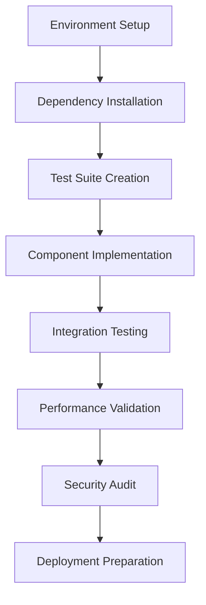

# AI Rails TDD Planning Document Template

> **Purpose**: This template enforces exhaustive pre-implementation research and Test-Driven Development methodology for AI coding agents. Based on the Micro Agent pattern (reliability score: 5/5) and comprehensive integration planning to prevent costly debugging cycles.

## Phase 1: Structured Task Decomposition with Advanced MCP-Sequential-Thinking

**Initialize Sequential-Thinking with Branching Strategy:**
```python
# Power User Setup: Enable multi-branch exploration
sequential_thinking_config = {
    "initial_thoughts": 10,  # Start conservative, adjust dynamically
    "enable_branching": True,
    "revision_threshold": 0.7,  # Revise if confidence < 0.7
    "tool_recommendation_mode": "comprehensive"
}
```

**Exploration Strategy:**
1. **Main Branch**: Conservative, proven approach
2. **Innovation Branch**: Explore cutting-edge solutions
3. **Fallback Branch**: Simple, reliable implementation
4. **Performance Branch**: Optimized but complex approach

**For Each Branch, Decompose:**
1. Atomic component breakdown with confidence scores
2. Dependency graph with alternative paths
3. Integration point mapping with fallback options
4. Data flow analysis with error propagation paths
5. State management requirements with consistency guarantees
6. Tool recommendations with alternatives and rationale

```json
{
  "branch_analysis": {
    "main": {
      "components": [],
      "confidence": 0.0,
      "recommended_tools": []
    },
    "alternatives": [],
    "selected_approach": "TBD after research"
  }
}
```

## Phase 2: Deep Technical Research with MCP-Omnisearch Orchestration

### A. Multi-Provider Search Strategy (Power User Mode)

**Parallel Search Execution:**
```python
# Execute searches across all providers simultaneously
omnisearch_strategy = {
    "brave": {
        "queries": [
            '"[Component A]" "[Component B]" compatibility -site:w3schools.com',
            'site:github.com issues "[Technology Stack]" "breaking changes"',
            'filetype:md "[Framework]" migration guide',
            'intitle:"post mortem" "[Similar Architecture]"',
            'before:2024 after:2023 "[Library]" performance regression'
        ],
        "operators": ["site:", "-site:", "filetype:", "intitle:", "before:", "after:"]
    },
    "kagi": {
        "queries": [
            # Kagi excels at technical documentation
            '"[Technology]" technical specification !seo',
            'site:official-docs.com "[API]" deprecation',
            '"[Framework]" benchmark results academic'
        ],
        "features": ["fastgpt_search", "enrichment"]
    },
    "tavily": {
        "queries": ["[Component] best practices production"],
        "include_domains": ["docs.official.com", "engineering.blogs.com"],
        "exclude_domains": ["medium.com", "dev.to"]  # Filter out noise
    },
    "perplexity": {
        "queries": ["explain [Complex Concept] tradeoffs implementation"],
        "mode": "comprehensive"  # AI synthesis mode
    }
}
```

### B. Context7 Advanced Documentation Mining

**Power User Documentation Strategy:**
```python
context7_strategy = {
    "phase1_discovery": {
        "action": "resolve_library_id",
        "search_terms": ["broad_term", "specific_term", "alternative_name"],
        "criteria": {
            "min_trust_score": 7,
            "prioritize": "code_snippet_count"
        }
    },
    "phase2_targeted": {
        "action": "get_library_docs",
        "library_id": "exact/id/from/phase1",
        "tokens": 20000,  # Increase for comprehensive docs
        "topic": "specific_feature_name",  # Laser-focused retrieval
        "versions": ["latest", "lts", "migration_target"]
    }
}
```

### C. StackOverflow Edge Case Mining

**Advanced Error Pattern Research:**
```python
stackoverflow_strategy = {
    "error_research": {
        "stack_traces": ["predicted_error_1", "predicted_error_2"],
        "min_score": 10,  # High-quality answers only
        "include_comments": True,  # Often contain crucial details
        "tags": ["technology-version", "specific-feature"],
        "combine_strategy": "AND"  # All tags must match
    }
}
```

### D. Dynamic Content Extraction (Firecrawl)

**For JavaScript-Heavy Documentation:**
```python
firecrawl_strategy = {
    "spa_docs": {
        "mode": "actions",
        "interactions": ["click_cookie_accept", "expand_all_sections"],
        "extract_depth": "advanced"
    },
    "site_mapping": {
        "mode": "map",  # Fast URL discovery
        "follow_up": "crawl"  # Deep extraction
    }
}
```

### E. Research Synthesis with Fact-Checking

**Multi-Stage Verification Pipeline:**
```python
verification_pipeline = {
    "stage1_generation": "Initial research findings",
    "stage2_grounding": {
        "tool": "jina_grounding_enhance",
        "purpose": "Fact-check all version numbers and compatibility claims"
    },
    "stage3_enrichment": {
        "tool": "kagi_enrichment_enhance",
        "purpose": "Add specialized knowledge from Teclis/TinyGem indexes"
    }
}
```

### F. Version Matrix Optimization (Evidence-Based)

| Component | Recommended | Min Viable | Max Tested | Known Incompatibilities | Evidence Sources | Confidence |
|-----------|-------------|------------|------------|------------------------|------------------|------------|
| [name]    | [version]   | [version]  | [version]  | [list]                 | [urls]           | [0.0-1.0]  |

## Phase 3: Risk Assessment & Mitigation with Predictive Research

### Sequential-Thinking Risk Analysis

**Use Branching to Explore Failure Modes:**
```python
risk_exploration = {
    "branch": "risk_analysis",
    "strategy": "For each component, create a thought branch exploring 'What could go wrong?'",
    "research_triggers": [
        "Search: '[Component] production failures'",
        "Search: '[Technology] memory leaks OR performance issues'",
        "StackOverflow: '[Error Pattern]' with min_score=20"
    ]
}
```

### Technical Risk Matrix (Research-Driven)

| Risk | Likelihood | Impact | Detection Method | Mitigation Strategy | Fallback Plan | Evidence | Monitoring |
|------|------------|--------|------------------|---------------------|---------------|----------|------------|
| [desc] | H/M/L | H/M/L | [automated test] | [preventive action] | [recovery] | [sources] | [metrics] |

### Critical Failure Points (Discovered via Research)
1. **Single Points of Failure**: Use Omnisearch to find similar architecture failures
2. **Cascading Failures**: Research with query "distributed system failure cascade [Technology]"
3. **Resource Exhaustion**: Context7 docs on resource limits + StackOverflow edge cases
4. **Race Conditions**: Brave search "site:github.com issues race condition [Framework]"

## Phase 4: Test-Driven Development Specification

### Test Generation Requirements (Micro Agent Pattern)

```typescript
interface TestSpecification {
  feature_description: string;
  behavioral_tests: BehaviorTest[];
  edge_cases: EdgeCase[];
  error_scenarios: ErrorTest[];
  performance_benchmarks: PerformanceCriteria[];
  integration_contracts: IntegrationTest[];
}
```

### Test Categories (Mandatory)
- [ ] **Unit Tests**: Isolated component behavior
- [ ] **Integration Tests**: Inter-component contracts
- [ ] **Contract Tests**: API schema validation
- [ ] **Property-Based Tests**: Invariant verification
- [ ] **Performance Tests**: Latency/throughput benchmarks
- [ ] **Chaos Tests**: Failure injection scenarios
- [ ] **Security Tests**: Vulnerability scanning

### Acceptance Criteria (Pydantic-Validated)

```python
from pydantic import BaseModel
from typing import List, Dict, Any

class AcceptanceCriteria(BaseModel):
    given: Dict[str, Any]  # Initial state
    when: str             # Action performed
    then: Dict[str, Any]  # Expected state
    invariants: List[str] # Conditions that must always hold
    
criteria = [
    AcceptanceCriteria(
        given={"state": "initial"},
        when="action_performed",
        then={"state": "expected"},
        invariants=["data_integrity", "performance_sla"]
    )
]
```

## Phase 5: Data Contract Specification

### Pydantic Models for All Handoffs

```python
from pydantic import BaseModel, Field, validator
from typing import Optional, List, Dict
from datetime import datetime

class AgentHandoff(BaseModel):
    """Enforced schema for inter-agent communication"""
    task_id: str = Field(..., regex="^[A-Z]{3}-[0-9]{6}$")
    source_agent: str
    target_agent: str
    payload: Dict[str, Any]
    context: Dict[str, Any]
    timestamp: datetime
    validation_hash: str
    
    @validator('payload')
    def validate_payload_structure(cls, v):
        # Custom validation logic
        return v
```

### JSON Schema Registry

```json
{
  "schemas": {
    "agent_handoff_v1": { "$ref": "#/definitions/AgentHandoff" },
    "test_result_v1": { "$ref": "#/definitions/TestResult" },
    "validation_report_v1": { "$ref": "#/definitions/ValidationReport" }
  },
  "version": "1.0.0"
}
```

## Phase 6: Implementation Strategy

### Pre-Implementation Checklist
- [ ] All dependencies version-locked with justification
- [ ] Performance benchmarks established
- [ ] Error handling strategies defined
- [ ] Rollback procedures documented
- [ ] Monitoring instrumentation planned
- [ ] Security review completed

### Implementation Sequence



### Atomic Implementation Steps
1. **Step**: [Specific action]
   - **Verification**: `command to verify success`
   - **Rollback**: `command to undo if failed`
   - **Timeout**: [seconds]
   - **Retry**: [count]

## Phase 7: Monitoring & Observability

### Success Metrics
```yaml
performance:
  latency_p99: < 100ms
  throughput_min: > 1000 rps
  error_rate_max: < 0.01%
  
reliability:
  uptime_sla: 99.95%
  mttr_max: < 5 minutes
  data_loss_tolerance: 0
  
quality:
  test_coverage_min: 95%
  cyclomatic_complexity_max: 10
  security_score_min: A
```

### Observability Stack
- **Metrics**: OpenTelemetry + Prometheus
- **Traces**: Jaeger distributed tracing
- **Logs**: Structured JSON with correlation IDs
- **Alerts**: PagerDuty integration with runbooks

## Phase 8: MCP Integration Specification

### Tool Registry Configuration
```json
{
  "mcp_client_config": {
    "version": "1.0",
    "tools": {
      "code_generator": {
        "server": "mcp://code-gen-service",
        "capabilities": ["generate", "validate", "test"]
      },
      "test_runner": {
        "server": "mcp://test-service",
        "capabilities": ["unit", "integration", "performance"]
      }
    },
    "authentication": "oauth2",
    "retry_policy": {
      "max_attempts": 3,
      "backoff": "exponential"
    }
  }
}
```

## Phase 9: Human-in-the-Loop Checkpoints

### Approval Gates
1. **Test Suite Approval**: Human validates generated tests
2. **Architecture Review**: Design validation before implementation
3. **Security Sign-off**: Pre-deployment security review
4. **Performance Baseline**: Acceptance of benchmark results

### HITL Node Configuration
```json
{
  "node_type": "human_approval",
  "timeout_seconds": 3600,
  "approval_criteria": {
    "test_coverage": ">= 95%",
    "security_scan": "passed",
    "performance_tests": "passed"
  },
  "escalation_path": ["team_lead", "architect", "security_team"]
}
```

## Deliverable Validation

### Quality Gates (All Must Pass)
- ✓ 100% of identified risks have mitigation strategies
- ✓ All components have 3+ authoritative documentation sources
- ✓ Every data handoff has Pydantic model validation
- ✓ Test suite achieves 95%+ code coverage
- ✓ Performance benchmarks established and documented
- ✓ Rollback procedures tested in staging environment
- ✓ Security review completed with no critical findings

---

## n8n Workflow Input Format

```json
{
  "planning_phase": "tdd_implementation",
  "feature_spec": {
    "name": "string",
    "complexity": "simple|medium|complex",
    "description": "string",
    "atomic_components": []
  },
  "research_results": {
    "compatibility_matrix": {},
    "version_recommendations": {},
    "known_issues": [],
    "best_practices": []
  },
  "test_specification": {
    "behavioral_tests": [],
    "edge_cases": [],
    "performance_criteria": {},
    "security_requirements": []
  },
  "data_contracts": {
    "pydantic_models": {},
    "json_schemas": {},
    "validation_rules": []
  },
  "risk_mitigation": {
    "identified_risks": [],
    "mitigation_strategies": {},
    "monitoring_plan": {}
  }
}
```

**Remember**: Research exhaustively, implement incrementally, validate continuously. The Micro Agent TDD pattern with comprehensive pre-planning yields the highest reliability scores for AI-generated code.

---

## Power User Research Orchestration Workflow

### Optimal MCP Tool Sequencing

```python
research_workflow = {
    "1_initial_exploration": {
        "tool": "mcp_sequential_thinking",
        "config": {
            "branches": ["conservative", "innovative", "fallback"],
            "thoughts_per_branch": 5,
            "enable_tool_recommendations": True
        }
    },
    "2_parallel_research": {
        "tools": ["brave_search", "kagi_search", "tavily_search"],
        "strategy": "Execute simultaneously for different perspectives",
        "brave_focus": "GitHub issues and technical problems",
        "kagi_focus": "High-quality technical documentation",
        "tavily_focus": "Factual specifications and standards"
    },
    "3_deep_documentation": {
        "tool": "context7",
        "strategy": "Two-phase approach",
        "phase1": "resolve_library_id with broad search",
        "phase2": "get_library_docs with topic focusing"
    },
    "4_edge_case_mining": {
        "tool": "stackoverflow_mcp",
        "config": {
            "min_score": 10,
            "include_comments": True,
            "focus": "Error patterns and workarounds"
        }
    },
    "5_dynamic_extraction": {
        "tool": "firecrawl (via omnisearch)",
        "when": "JavaScript-heavy sites or dynamic content",
        "modes": ["map", "crawl", "actions", "extract"]
    },
    "6_fact_verification": {
        "tool": "jina_grounding_enhance",
        "purpose": "Verify all technical claims"
    },
    "7_knowledge_enrichment": {
        "tool": "kagi_enrichment_enhance",
        "purpose": "Add specialized/non-mainstream knowledge"
    }
}
```

### Advanced Search Operators Reference

**Brave & Kagi Power Syntax:**
- `site:github.com issues "exact error"` - Find specific issues
- `-site:medium.com -site:dev.to` - Exclude content farms
- `filetype:pdf OR filetype:md` - Technical documents only
- `intitle:"RFC" OR intitle:"PEP"` - Find specifications
- `before:2024-01-01 after:2023-01-01` - Time-boxed search
- `"phrase 1" AROUND(5) "phrase 2"` - Proximity search

**Context7 Version Targeting:**
- `/org/lib` - Latest stable version
- `/org/lib/v2.1.0` - Specific version
- `/org/lib/canary` - Bleeding edge docs

### Research Quality Checklist

Before proceeding to implementation:
- [ ] All critical components researched across 3+ sources
- [ ] Version compatibility verified with evidence
- [ ] Common failure modes identified via GitHub/StackOverflow
- [ ] Performance characteristics documented from benchmarks
- [ ] Security vulnerabilities checked against CVE databases
- [ ] Edge cases discovered through error pattern mining
- [ ] All findings fact-checked via Jina grounding
- [ ] Knowledge enriched with specialized sources

### MCP Tool Confidence Scoring

When Sequential-Thinking recommends tools, expect confidence scores:
- **0.9-1.0**: Highly relevant, use immediately
- **0.7-0.9**: Relevant, consider alternatives
- **0.5-0.7**: Potentially useful, evaluate carefully
- **< 0.5**: Low relevance, seek alternatives